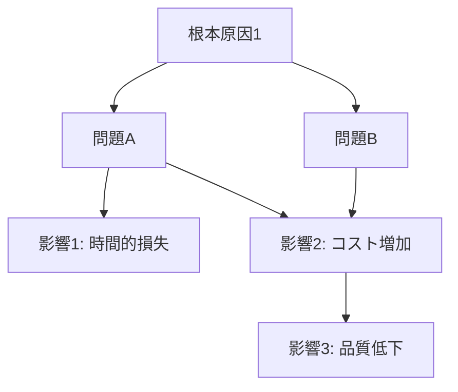

現状の問題と分析結果
=========================

基本情報
-------------------------

### 作りたいシステムについて

- システム名: {システム名がわかっている場合は記載、わからない場合は「未定」}
- システムの目的: {何のためのシステムなのかを簡潔に説明}
- 参考システム: {参考にするシステムやサービスがある場合は記載}
    - 参考システム名: {システム名}
    - 参考理由: {なぜそのシステムを参考にするのか}

### 今困っていること

- 問題1: {具体的にどんなことで困っているか}
- 問題2: {他にも困っていることがあれば記載}
- まだわからないこと: {ヒアリングで判明しなかった項目}

### 関係する人たち

- {役職名}: {この人がどう関わるか、どんな影響があるか}
- {役職名}: {この人がどう関わるか、どんな影響があるか}
- まだわからないこと: {まだ聞けていない関係者について}

### 今の仕事の流れ

- 手順1: {現在どんな作業をしているか}
- 手順2: {次にどんな作業をしているか}
- まだわからないこと: {詳しく聞けていない作業について}

### システムに求めること

- 要望1: {システムでどんなことを実現したいか}
- 要望2: {他にもやりたいことがあれば記載}

参考システムの分析
-------------------------

### 参考システムの調査結果（参考システムがある場合のみ）

#### 参考システムの機能・特徴

- 主要機能1: {機能の詳細}
- 主要機能2: {機能の詳細}
- アーキテクチャ: {システム構成の特徴}
- 技術スタック: {使用されている技術}

#### 参考システムから学べる設計思想・ベストプラクティス

- 設計思想1: {内容} - {新システムへの応用方法}
- 設計思想2: {内容} - {新システムへの応用方法}
- ベストプラクティス: {参考になる実装方法やアプローチ}

#### 参考システムでは解決できない課題・制約

- 制約1: {内容} - {新システムでの改善案}
- 制約2: {内容} - {新システムでの改善案}
- 未解決課題: {参考システムが対応していない要求事項}

#### 参考システムの知見を活用した実装方針

- 採用すべきアプローチ: {参考システムから学ぶべき手法}
- 改善すべき点: {参考システムの課題を解決する方法}
- 技術選定への影響: {参考システムの技術を踏まえた選択}

問題構造の可視化
-------------------------

### 現状の業務プロセス（フローチャート）

```mermaid
flowchart LR
    A[開始] --> B[工程1: {作業内容}]
    B --> C[工程2: {作業内容}]
    C --> D[工程3: {作業内容}]
    D --> E[完了]

    B -.-> F["{問題の内容}<br/>（問題発生箇所）"]
    C -.-> G["{遅延の原因}<br/>（ボトルネック）"]
    D -.-> H["{品質問題}<br/>（課題箇所）"]

    F -.-> I[影響1]
    G -.-> J[影響2]
    H -.-> K[影響3]
```

### 問題の関連図



問題の原因を探る
-------------------------

### なぜその問題が起きているのか？

#### 問題1の原因分析

1. 問題: {問題1の内容}
    - なぜ？: {原因1}
2. 問題: {原因1}
    - なぜ？: {原因2}
3. 問題: {原因2}
    - なぜ？: {原因3}
4. 問題: {原因3}
    - なぜ？: {原因4}
5. 問題: {原因4}
    - なぜ？: {根本原因1}

根本原因: {問題1の最終的な根本原因}

#### 問題2の原因分析（該当する場合）

1. 問題: {問題2の内容}
    - なぜ？: {原因1}
2. 問題: {原因1}
    - なぜ？: {原因2}
3. 問題: {原因2}
    - なぜ？: {原因3}
4. 問題: {原因3}
    - なぜ？: {原因4}
5. 問題: {原因4}
    - なぜ？: {根本原因2}

根本原因: {問題2の最終的な根本原因}

#### 共通する根本原因（複数問題に共通の原因がある場合）

- {複数の問題に共通する根本的な原因}

### 問題の影響

- 困っている人: {どの部署の何人くらいが影響を受けているか}
- 困り具合: [高/中/低]（3段階で評価）
- お金の損失: {わかる範囲で、どのくらいの損失があるか}

関係者の整理
-------------------------

### システムに対する関心と影響力

- 高関心・高影響: {名前や役職}
    - 重要な意思決定者
- 高関心・低影響: {名前や役職}
    - 積極的な協力者
- 低関心・高影響: {名前や役職}
    - 理解促進が必要
- 低関心・低影響: {名前や役職}
    - 最低限の情報共有

解決すべき課題の優先順位
-------------------------

### [最優先] 最優先で解決すべきこと

- 課題1: {内容} - {なぜ最優先なのか理由}
- 課題2: {内容} - {なぜ最優先なのか理由}

### [重要] できれば解決したいこと

- 課題1: {内容} - {解決の必要性}
- 課題2: {内容} - {解決の必要性}

### [希望] 余裕があれば取り組むこと

- 課題1: {内容} - {解決できれば良い理由}
- 課題2: {内容} - {解決できれば良い理由}

システム化で期待できる効果
-------------------------

### 数字で測れる効果

- 時間の節約: 1日あたり{○○時間}短縮
- コストの削減: 年間{○○万円}削減
- 作業量の改善: 1時間で{○○件}多く処理可能
- ROI（投資対効果）: 投資額{○○万円}に対し、年間{○○万円}の効果（回収期間: {○○ヶ月}）

### 数字では測りにくいが重要な効果

- 仕事の質の向上: {具体的な改善内容}
- 働きやすさの改善: {具体的な効果}
- その他の良い効果: {その他の効果}

要件の妥当性検証
-------------------------

### 提示された要件の評価

#### 要件1: {要件の内容}

- 問題解決への適合度: [高/中/低] - {理由}
- 実現可能性: [高/中/低] - {技術的制約や課題}
- 優先度: [高/中/低] - {なぜその優先度なのか}

#### 要件2: {要件の内容}

- 問題解決への適合度: [高/中/低] - {理由}
- 実現可能性: [高/中/低] - {技術的制約や課題}
- 優先度: [高/中/低] - {なぜその優先度なのか}

### 代替案・追加検討事項

- 代替案1: {内容} - {メリット・デメリット}
- 代替案2: {内容} - {メリット・デメリット}
- 参考システムの知見を活用した要件改善提案: {参考システムの分析から得られた改善案}
- 追加検討事項: {検討すべき要件や機能}

### 技術的実現方法の概要

- アーキテクチャ: {システム構成の概要}
- 主要技術: {使用予定の技術スタック}
- 参考システムの設計思想の適用: {参考システムから学んだ設計原則の活用方法}
- 開発期間の見積もり: {フェーズ別の期間}
- 技術的制約: {制約事項と対応方法}

もっと詳しく聞きたいこと
-------------------------

### [緊急] 緊急度が高い確認事項

- {確認事項1}: {理由}
- {確認事項2}: {理由}

### [重要] 重要な確認事項

- {確認事項1}: {理由}
- {確認事項2}: {理由}

### [希望] 余裕があれば確認したい事項

- {確認事項1}: {理由}
- {確認事項2}: {理由}

次回のお話し合いについて
-------------------------

### 準備していただきたい資料

- {資料名}: {目的・用途}
- {資料名}: {目的・用途}

### 参加していただきたい方

- 必須: {役職・部署} - {理由}
- 推奨: {役職・部署} - {理由}

### 次回確認したい項目（優先順）

1. {確認項目1}: {理由}
2. {確認項目2}: {理由}
3. {確認項目3}: {理由}

想定されるリスク
-------------------------

### 技術面のリスク

- {リスク内容}
    - 対策: {対策内容}
- {リスク内容}
    - 対策: {対策内容}

### 業務面のリスク

- {リスク内容}
    - 対策: {対策内容}
- {リスク内容}
    - 対策: {対策内容}

### プロジェクト管理のリスク

- {リスク内容}
    - 対策: {対策内容}
- {リスク内容}
    - 対策: {対策内容}

推奨する進め方
-------------------------

### 第1段階（1-3ヶ月）

- {対応内容}: {理由}
- {対応内容}: {理由}

### 第2段階（3-6ヶ月）

- {対応内容}: {理由}
- {対応内容}: {理由}

### 第3段階（6ヶ月以降）

- {対応内容}: {理由}
- {対応内容}: {理由}
