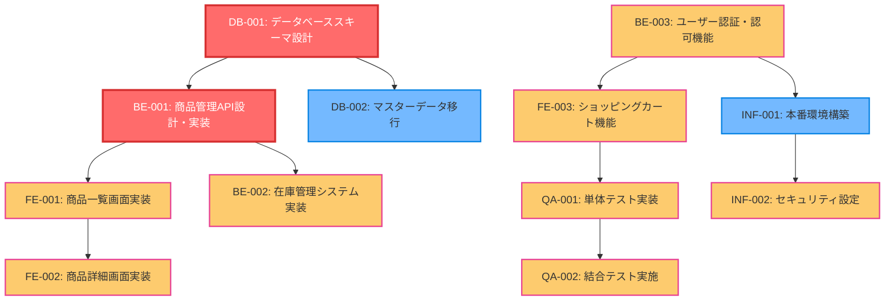

タスクリスト
=========================

プロジェクト概要
-------------------------

- プロジェクト名: ECサイトリニューアル
- 分析対象: 要件定義書、Backlogチケット、ユーザーストーリー
- 分析日時: 2025年8月3日

フロントエンド開発タスク
-------------------------

### 1.1 商品一覧画面の実装

- タスクID: FE-001
- 優先度: 高
- 依存関係: API設計完了（BE-001）
- 完了条件: レスポンシブ対応済み、検索・フィルタ機能動作確認完了
- リスク要因: デザインシステムの仕様変更可能性（中リスク）

#### 子タスク

- FE-001-1 商品一覧レイアウト作成
    - 完了条件: レスポンシブデザイン対応、デザインレビュー完了
- FE-001-2 検索・フィルタ機能実装
    - 完了条件: カテゴリ、価格帯、キーワード検索の動作確認完了
- FE-001-3 ページネーション機能実装
    - 完了条件: ページ遷移とデータ取得の動作確認完了

### 1.2 商品詳細画面の実装

- タスクID: FE-002
- 優先度: 高
- 依存関係: 商品一覧画面実装完了（FE-001）
- 完了条件: 画像ズーム機能、レビュー表示機能の動作確認完了
- リスク要因: 画像最適化の技術選定（低リスク）

#### 子タスク

- FE-002-1 商品詳細レイアウト作成
    - 完了条件: レスポンシブデザイン対応、デザインレビュー完了
- FE-002-2 画像ズーム機能実装
    - 完了条件: ズーム・パン操作の動作確認完了
- FE-002-3 レビュー表示機能実装
    - 完了条件: レビュー一覧とページネーションの動作確認完了

### 1.3 ショッピングカート機能の実装

- タスクID: FE-003
- 優先度: 高
- 依存関係: 認証機能実装完了（BE-003）
- 完了条件: 商品追加・削除・数量変更の動作確認完了
- リスク要因: セッション管理の複雑性（中リスク）

#### 子タスク

- FE-003-1 カート画面レイアウト作成
    - 完了条件: レスポンシブデザイン対応、デザインレビュー完了
- FE-003-2 カート操作機能実装
    - 完了条件: 商品追加・削除・数量変更の動作確認完了
- FE-003-3 カート状態管理実装
    - 完了条件: セッション連携とデータ永続化の動作確認完了

バックエンド開発タスク
-------------------------

### 2.1 商品管理API設計・実装

- タスクID: BE-001
- 優先度: 最高
- 依存関係: データベース設計完了（DB-001）
- 完了条件: OpenAPI仕様書作成、単体テスト完了、レスポンス速度1秒以内
- リスク要因: 検索パフォーマンスの最適化（高リスク）

#### 子タスク

- BE-001-1 OpenAPI仕様書作成
    - 完了条件: API仕様レビュー完了、フロントエンド担当者承認取得
- BE-001-2 商品CRUD API実装
    - 完了条件: 基本的な登録・参照・更新・削除の動作確認完了
- BE-001-3 商品検索API実装
    - 完了条件: 検索条件とソート機能の動作確認完了
- BE-001-4 パフォーマンス最適化
    - 完了条件: レスポンス時間1秒以内の性能要件達成

### 2.2 在庫管理システムの実装

- タスクID: BE-002
- 優先度: 高
- 依存関係: 商品管理API実装完了（BE-001）
- 完了条件: 在庫同期バッチ処理の動作確認完了
- リスク要因: 外部システム連携の遅延（中リスク）

#### 子タスク

- BE-002-1 在庫管理API実装
    - 完了条件: 在庫数更新・参照APIの動作確認完了
- BE-002-2 在庫同期バッチ処理実装
    - 完了条件: 外部システムとの同期処理の動作確認完了
- BE-002-3 在庫不足アラート機能実装
    - 完了条件: 閾値設定と通知機能の動作確認完了

### 2.3 ユーザー認証・認可機能の実装

- タスクID: BE-003
- 優先度: 高
- 依存関係: セキュリティ要件確定
- 完了条件: JWT実装、セキュリティテスト完了
- リスク要因: セキュリティ脆弱性の発見（高リスク）

#### 子タスク

- BE-003-1 JWT認証機能実装
    - 完了条件: ログイン・ログアウト・トークン検証の動作確認完了
- BE-003-2 権限管理機能実装
    - 完了条件: ロールベースアクセス制御の動作確認完了
- BE-003-3 パスワードリセット機能実装
    - 完了条件: メール送信とパスワード変更の動作確認完了

データベース設計・構築タスク
-------------------------

### 3.1 データベーススキーマ設計

- タスクID: DB-001
- 優先度: 最高
- 依存関係: なし
- 完了条件: ER図作成、正規化完了、レビュー承認取得
- リスク要因: パフォーマンス要件との整合性（中リスク）

#### 子タスク

- DB-001-1 ER図設計
    - 完了条件: エンティティ関係図の作成とレビュー完了
- DB-001-2 テーブル設計・正規化
    - 完了条件: 第3正規形までの正規化とパフォーマンス検証完了
- DB-001-3 インデックス設計
    - 完了条件: 検索性能要件を満たすインデックス設計完了

### 3.2 マスターデータ移行

- タスクID: DB-002
- 優先度: 中
- 依存関係: データベーススキーマ設計完了（DB-001）
- 完了条件: データ整合性確認、移行テスト完了
- リスク要因: 既存データの品質問題（高リスク）

#### 子タスク

- DB-002-1 データクレンジング
    - 完了条件: 既存データの品質検証と修正完了
- DB-002-2 移行スクリプト作成
    - 完了条件: データ移行処理の動作確認完了
- DB-002-3 移行テスト実施
    - 完了条件: 本番想定環境での移行テスト成功

インフラ・デプロイタスク
-------------------------

### 4.1 本番環境構築

- タスクID: INF-001
- 優先度: 中
- 依存関係: アプリケーション実装完了
- 完了条件: CI/CDパイプライン構築、監視設定完了
- リスク要因: クラウドサービスの障害（低リスク）

#### 子タスク

- INF-001-1 クラウドインフラ構築
    - 完了条件: サーバー、ネットワーク、ストレージの構築完了
- INF-001-2 CI/CDパイプライン構築
    - 完了条件: 自動デプロイ機能の動作確認完了
- INF-001-3 監視・ログ設定
    - 完了条件: 監視ダッシュボードとアラート設定完了

### 4.2 セキュリティ設定

- タスクID: INF-002
- 優先度: 高
- 依存関係: 本番環境構築完了（INF-001）
- 完了条件: SSL証明書設定、WAF設定、ペネトレーションテスト完了
- リスク要因: セキュリティ要件の追加（中リスク）

#### 子タスク

- INF-002-1 SSL証明書設定
    - 完了条件: HTTPS通信の有効化と動作確認完了
- INF-002-2 WAF・セキュリティ設定
    - 完了条件: ファイアウォール設定とセキュリティポリシー適用完了
- INF-002-3 ペネトレーションテスト
    - 完了条件: 第三者による脆弱性検査と対策完了

テスト・品質保証タスク
-------------------------

### 5.1 単体テスト実装

- タスクID: QA-001
- 優先度: 高
- 依存関係: 各機能実装完了
- 完了条件: カバレッジ90%以上、全テストケース通過
- リスク要因: テスト環境の不安定性（中リスク）

#### 子タスク

- QA-001-1 フロントエンド単体テスト実装
    - 完了条件: コンポーネントテストとユニットテストの実装完了
- QA-001-2 バックエンド単体テスト実装
    - 完了条件: APIテストとビジネスロジックテストの実装完了
- QA-001-3 テストカバレッジ検証
    - 完了条件: カバレッジ90%以上の達成確認

### 5.2 結合テスト実施

- タスクID: QA-002
- 優先度: 高
- 依存関係: 単体テスト完了（QA-001）
- 完了条件: シナリオテスト完了、パフォーマンステスト合格
- リスク要因: 外部システム連携の不具合（中リスク）

#### 子タスク

- QA-002-1 システム結合テスト実施
    - 完了条件: フロントエンド・バックエンド間の連携テスト完了
- QA-002-2 ユーザーシナリオテスト実施
    - 完了条件: エンドツーエンドでの業務シナリオテスト完了
- QA-002-3 パフォーマンステスト実施
    - 完了条件: 負荷テストと性能要件の達成確認完了

タスク依存関係図
-------------------------

工数・優先度マトリックス
-------------------------

| タスクID | タスク名 | 優先度 | 実行順序 | 備考 |
|----------|----------|--------|----------|------|
| DB-001 | データベーススキーマ設計 | 最高 | 1 | プロジェクトの基盤となる設計 |
| BE-001 | 商品管理API設計・実装 | 最高 | 2 | 他の機能の前提となるAPI |
| BE-003 | ユーザー認証・認可機能 | 高 | 3 | セキュリティの基盤機能 |
| FE-001 | 商品一覧画面実装 | 高 | 4 | ユーザー向け主要機能 |
| FE-002 | 商品詳細画面実装 | 高 | 5 | 商品一覧に続く重要機能 |
| FE-003 | ショッピングカート機能 | 高 | 6 | ECサイトの核となる機能 |
| BE-002 | 在庫管理システム実装 | 高 | 7 | 商品管理の補完機能 |
| QA-001 | 単体テスト実装 | 高 | 8 | 品質保証の基盤 |
| QA-002 | 結合テスト実施 | 高 | 9 | 総合的な品質確認 |
| INF-002 | セキュリティ設定 | 高 | 10 | 本番稼働前の必須作業 |
| DB-002 | マスターデータ移行 | 中 | 11 | 本番運用準備 |
| INF-001 | 本番環境構築 | 中 | 12 | デプロイ基盤の整備 |

リスク分析表
-------------------------

| リスクレベル | タスクID | リスク内容 | 影響度 | 発生確率 | 対応策 |
|--------------|----------|------------|--------|----------|--------|
| 高 | BE-001 | 検索パフォーマンス最適化 | 高 | 中 | インデックス設計見直し、キャッシュ導入検討 |
| 高 | BE-003 | セキュリティ脆弱性発見 | 高 | 中 | 外部セキュリティ監査の実施 |
| 高 | DB-002 | 既存データ品質問題 | 中 | 高 | データクレンジング工程の追加 |
| 中 | FE-001 | デザインシステム仕様変更 | 中 | 中 | デザイナーとの定期レビュー実施 |
| 中 | FE-003 | セッション管理の複雑性 | 中 | 中 | 技術調査工程の前倒し実施 |
| 中 | BE-002 | 外部システム連携遅延 | 中 | 中 | モックAPIでの並行開発 |
| 中 | DB-001 | パフォーマンス要件整合性 | 中 | 低 | 要件定義段階での詳細確認 |
| 中 | INF-002 | セキュリティ要件追加 | 低 | 中 | セキュリティ要件の早期確定 |
| 中 | QA-001, QA-002 | テスト環境・外部連携不具合 | 中 | 中 | テスト環境の冗長化、モック環境準備 |

総タスク数: 12件  
クリティカルパス: DB-001 → BE-001 → FE-001 → FE-002 → QA-001 → QA-002  
優先度別分布: 最高(2件)、高(8件)、中(2件)
